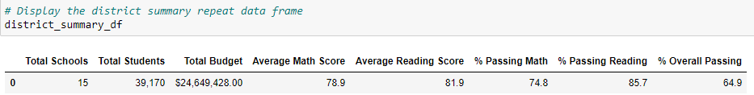
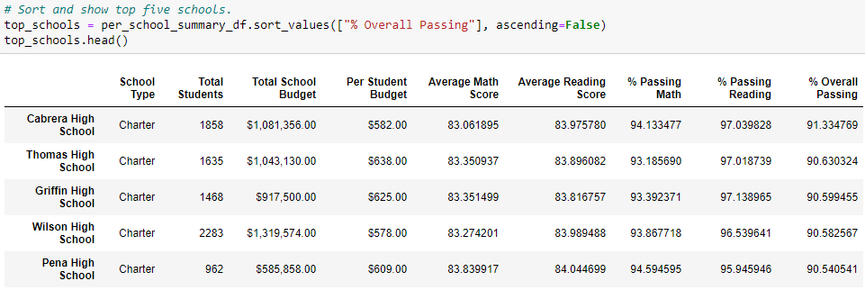
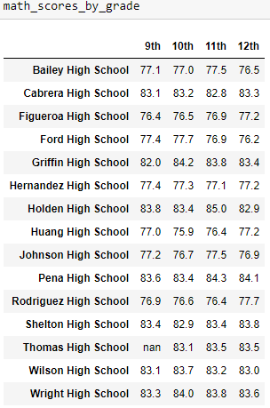
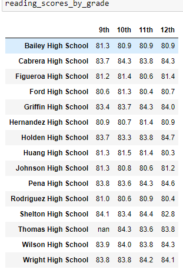
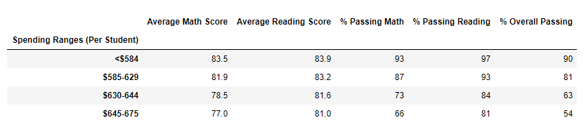
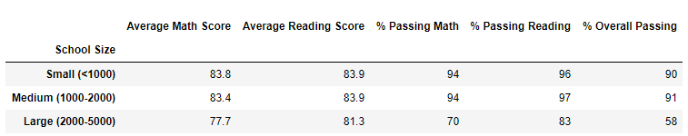
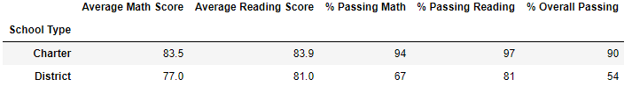

# School_District_Analysis
Performing analysis on school district exam data

## Overview of the school district analysis
The chief data scientist for a city school district will be assisted with analyzing the district exam data to showcase trends in school performance.  Preliminary results showed evidence of academic dishonesty; specifically, reading and math grades for Thomas High School ninth graders appear to have been altered. 

You have been given the following tasks to complete the school district exam analysis:  

1. Replace the ninth-grade reading and math scores for Thomas High School(THS).
2. Repeat the school district analysis and generate the following
    - The School District Summary 
    - The School Summary 
    - High and Low Performing Schools
    - Average Math and Reading Scores by Grade
    - Group Scores by School Spending per Student
    - Group Scores by School Size
    - Group Scores by School Type

## Resources
- Data Source: This analysis was performed using the [schools_complete.csv](https://github.com/aobasuyi/School_District_Analysis/blob/main/Resources/schools_complete.csv) and the [students_complete.csv](https://github.com/aobasuyi/School_District_Analysis/blob/main/Resources/students_complete.csv) datasets.
- Software: Python 3.7.6 :: Anaconda, Inc., conda 4.10.1, Visual Studio Code, 1.56

## School District Results

- **Codes used to replace Ninth-Grade Reading and Math Scores:**  
The *loc* method was used to select all the reading and math scores from the ninth grade at Thomas High School and replaced with NaNs (codes and figure below).  

A. **District summary results:**  
- The school district summary provides a high-level snapshot of the district's key metrics. Replacing the scores of Thomas High school (THS) ninth graders slightly reduced the district's key metrics. There are 39,170 students in the district and Thomas High school (THS) has only 461 students in ninth grade.

    

    

B. **School summary results:**  
The percentage of THS students who passed who passed Math, Reading were:  

- Before replacing the grades of ninth graders:
    - Math = 66.91%
    - Reading = 69.66%
    - Math and Reading = 65.07%
- After replacing the grades of ninth graders: 
    - Math = 93.19%
    - Reading = 97.02%
    - Math and Reading = 90.63%
- Replacing Thomas High School (THS) ninth graders’ math and reading scores improved the passing percentage and the performance of the school. It went from a low performing to the second highest performing school in the district.

   

C. **Math and Reading Scores by grade**  
- The THS ninth graders replaced scores are shown below as NaN. The scores for grades 10 to 12 Math and reading averages remained consistent at about 83.4% and 83.9% respectively, which are comparable to other high performing schools.

| Math score per grade  | Reading score per grade |
| ------------------------------------------------------------------- | -------------------------------------------------------- |
|      |      |

D. **Scores by school spending**  
- THS spending range per student falls within the $630-644 range. The figure below shows that THS outperformed other schools within this spending range after the ninth graders scores were replaced.

   

E. **Scores school size**  
- The THS school size falls within the Medium school size of (1000-2000). The school performed similarly to other schools of the same size.

   

F. **Scores by school type**
 - The THS school type is charter school. The THS students Math and Reading scores were similar to those of others in Charter schools

   

## Summary
Four changes in the updated school district analysis after Thomas High School ninth graders Math and Reading scores were replaced with NaNs include:
1. Thomas High School (THS) Math and Reading scores passing percentage improved from an average of 67.1% to average of 93.5%.
2. The school performance improved from low to the second highest performance in the school district.
3. The avearge scores by grades 10 to 12 were among the highest in the district
4. The school outperformed other schools within the same spending range per student.
5. The school performed similary to other schools within same school size and type.
